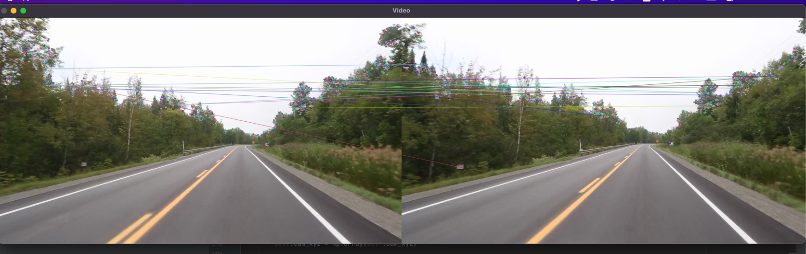
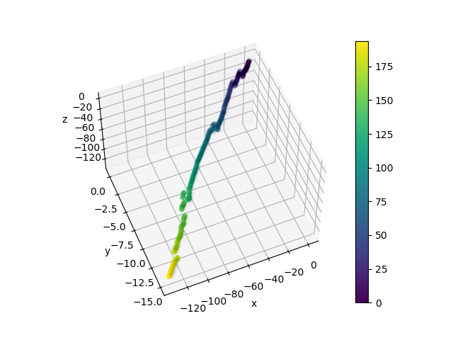

# cv-slam
A computer vision learning repo, trying to work on SLAM Tracking.
Using Python,and OpenCV.

Detect and match keypoints:

Extract 3D position of Camera and Landmarks:

# Credits:
Test videos are from https://github.com/geohot/twitchslam repo. (follow their respective licenses)
(Note: in docs.txt there is a list of sources that I learnt from)